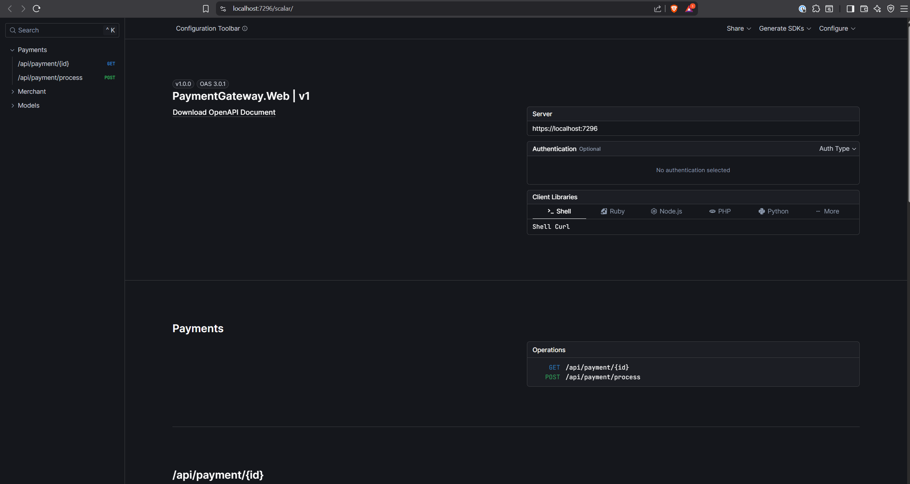

# Instructions to run project

## Pre-requirements
- Docker installed
- Aspire CLI installed

## Key Design Decisions
- Uses .NET Aspire for local development orchestration and infrastructure provisioning.
- All infrastructure dependencies (e.g., databases, queues) are containerized and managed via Aspire.
- Sensitive configuration (e.g., encryption keys) is managed using .NET user secrets for local development.
- The solution is designed for easy local onboarding: running a single command starts all services and dependencies.
- The cqrs was consider, but to simplify and to follow the requirements, the project is not using cqrs.
- Payment gateway is dependant on few external services, such as bank simulator and payment processor, so it is imporant to make request resilient. To achieve it I used Polly for http clients and Retry policy for entity framework.

## Assumptions
- Developer has Docker and Aspire CLI installed and running.
- The provided encryption key is for development only and should be replaced for production.
- The default ports and URLs exposed by Aspire are available and not blocked by other processes.

## Dotnet secrets
```json
{
  "DbSettings": {
    "EncryptionKey": "00000000000000000000000000000000"
  }
}
```

## Infrastructure
This project uses .NET Aspire to create and scaffold infrastructure. Aspire uses local Docker, so all required dependencies are automatically pulled and started as Docker images.
To start the full solution (app + infrastructure):
```shell
dotnet aspire run
```
### Used services
- Postgres
- pg admin
- Bank Simulator
## Running solution first time
First time you run the solution, it will take a while to pull all the images and start the infrastructure. 
Also first run you might see some error in the aspire console, but it is caused by the fact that the infrastructure is not ready yet.
## Using Solution:
All below can be done by using scalar available https://localhost:7296/scalar/ 

1. Create a merchant by doing post request to `https://localhost:7296/api/merchant/create` with no body, but with authorization header. it should return json such as:
```json
{
  "id": "1",
  "apiKey": "7258bd1c353b45c6be67087ada93dced"
}
```
2. Create a payment by sending request to `https://localhost:7296/api/payment/create` with body:
```json
{
  "CardNumber" : "2222405343248873",
  "ExpiryMonth" : "4",
  "ExpiryYear" :"2025",
  "Currency" : "GBP",
  "Amount" : "100",
  "Cvv" : "123",
  "Name" : "Test User"
}
```
and with authorization header (X-API-Key: and value will be the api key from merchant created in step 1).
        
3. Get payment status by sending request to `https://localhost:7296/api/payment/{paymentId}` with authorization header (X-API-Key: and value will be the api key from merchant created in step 1).

## Test
This project uses xUnit and nSubstitute for unit testing.
Test are located in the `Tests` folder and are categorised by type and feature.

Project PaymentGateway.IntegrationTests contains integration tests with usage of aspire and bank simulator.

Project PaymentGateway.UnitTests contains unit tests, and mock most of the dependencies.

To run tests:
```shell
dotnet test
```
## Potential Improvements
- Add CI/CD pipeline for automated testing and deployment.
- Improve monitoring and logging, including metrics and tracing, also creating custom metrics such as succesfull payments, how money is transferred, etc.
- Enhance security by rotating secrets and using secure vaults for production.
- Add more comprehensive integration and end-to-end tests.
- introducing cqrs and event sourcing using wolverine or MediatR
- using redis instead of memory cache for caching decorator
- using some queue system to handle incoming payments (e.g., RabbitMQ) based on assumption we using cqrs and event sourcing to update the merchants
### Recommended Hosting
- Azure Container Apps or Azure Kubernetes Service (AKS) for scalable, managed container hosting.
- Some of services can be run as native cloud services, such as Postgres, App service.
- Some logic can be moved to serverless functions, such as payment processing.
- Any cloud provider supporting Docker containers (e.g., AWS ECS, Google Cloud Run).
- For production, ensure secure secret management and configure persistent storage for databases.